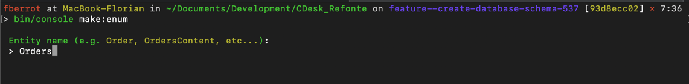
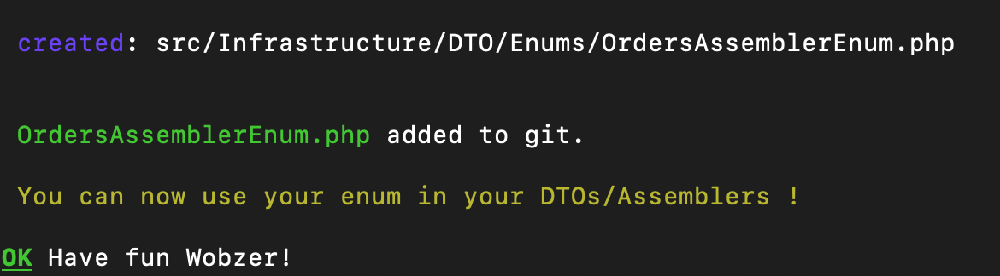

# Enum of properties for a doctrine entity 🚀
```bash 
php bin/console make:enum-of-properties
```

## Started 📖
**After you run the command,you have to fill the entity name:**



**After this, you simply will have the following file in your project:**



The file (an Enum) will be composed of all the properties of your entity.

```php
<?php

namespace App\Infrastructure\DTO\Enums;

enum OrdersAssemblerEnum: string
{
    case ID = 'id';
    case NAME = 'name';
    case PRICE = 'price';
    case QUANTITY = 'quantity';
    case CREATED_AT = 'createdAt';
    case UPDATED_AT = 'updatedAt';
    
    // etc...
    
    // Here you can add some methods if you want.
}

```

