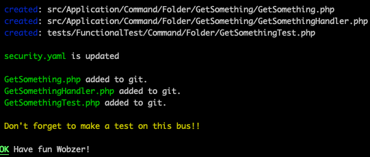

# Maker Bundle

## Description ✏️
This is a maker bundle for bus message templates. 
It provides from you to create a message template for your business.  

## Requirements 📋
* PHP 8.1 or higher;
* Symfony 5.4 or higher;
* Composer;
* Maker Bundle;
* 
  
## Installation 📦
```bash
composer require wobz/maker-bundle:last-version --dev
```

## Usage 🚀
```bash 
php bin/console make:wobz-bus-message
```

## Example 📖
* After you run the command, fill all the fields and you will get the following:  


* Add some properties to your bus message:  


* After you finish, you will get the following:  

  
* You can find your bus message here:  

* And you will have your properties !    
  


* For test class, you have to check in your composer and config to create it where you want
## Contributing 🤝
Pull requests are welcome. For major changes, please open an issue first to discuss what you would like to change.


