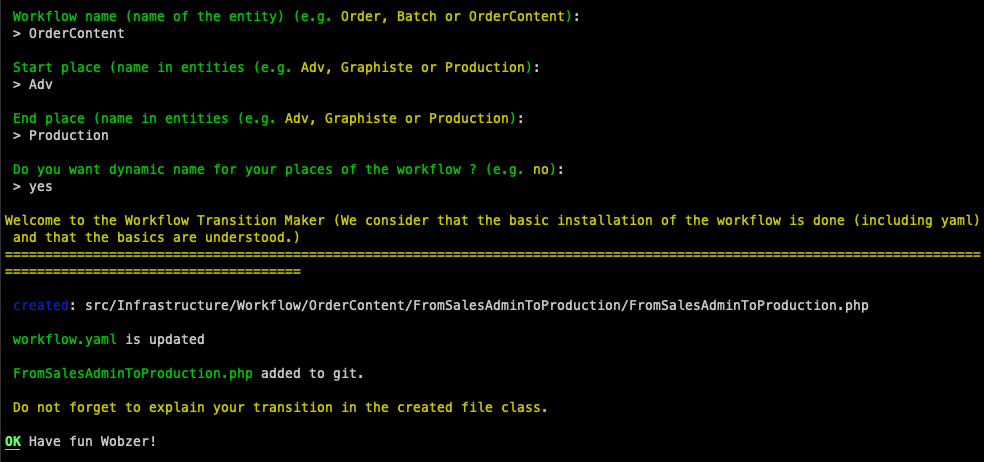

# Workflow Transition 🚀
```bash
php bin/console make:workflow-transition
```

**After your un the command, fill all the asked fields and you will get the following:**



**Your file will be in the path :**
```php
src/Infrastructure/Workflow/YourEntity/YourTransition/YourTransition.php
```

**Your workflow.yaml will be updated :**

```yaml
from_sales_admin_to_designer:
    from: Adv
    to: Graphiste
```

### PS: last option (dynamic names for places) is configurable in services.yaml with this format:
```yaml
        wobz_workflow:
        entity:
#            TODO: add your own entities here in your services.yaml for your project
            - Order:
                fqcn: Class to your entity/model
                enum:
                    fqcn: Class path to your enum
                    method: your method
```

**The enum have to be like this:**
```php
enum BatchStatusEnum: string
{
 // Here it'static an enum with static values and with no method.static
 // In this case , you can delete method key in enum yaml configuration
    case PLACE = "Place";
}
```
or:
```php
enum OrderStatusEnum: string
{
    case PLACE = "place";
        
    // In the yaml, you will have to add the method key "getTraduction"
    public function getTraduction(): string
    {
        return match ($this) {
            self::PLACE => "Status",
        };
    }
}
```