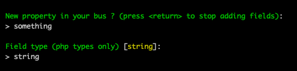
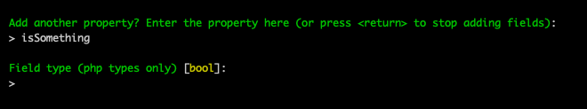
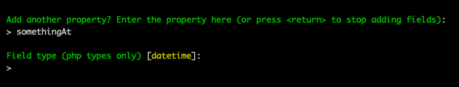
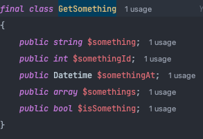

# Bus Message 🚀
```bash 
php bin/console make:bus-message
```

## Started 📖
**After you run the command, fill all the fields and you will get the following:**


**Add some properties to your bus message:**





**After you finish, you will get the following:**  


**You can find your bus message here:**
```php
src/Application/Query/GetSomething/ 
```

**And you will have your properties !**


  

**Your services.yaml is updated to ! (you can change it if you want)**

```yaml
    App\Application\Query\Folder\GetSomething\GetSomethingHandler:
        tags: [ { name: messenger.message_handler, bus: query.bus } ]
        autoconfigure: false
```  
  
**Handler default configuration:**  
  
By default, yaml in services.yaml is not updated, you have to add `-y=true` to the command.  
Without this, you will have this type of configuration:
```php
#[AsMessageHandler(bus: 'BUSTYPE.bus')]    
```

**For test class, you have to check in your composer and config yaml to create it where you want**
**By default, it's in the test folder**
```php
    tests/FunctionalTests/
```
